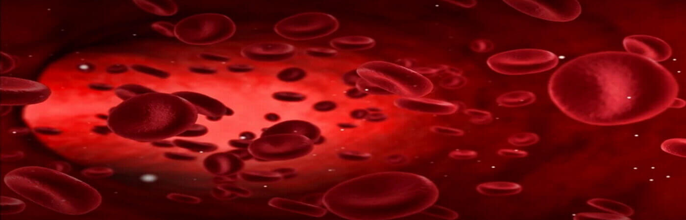
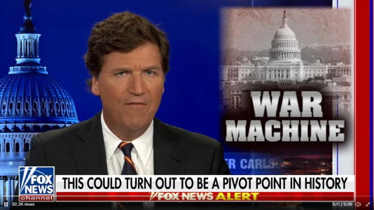

Update as of 3/8/2020

Dollars to Ukraine 13 billion is about 300 thousand dollars per person in Ukraine. and alot of them are Russians, and other non Ukrainian citizens Thats insane, and then we are told Ukraine can by weapons from the USA for the war.

Our whole administration are thieves and Traitors, They started this war intentionally for profit. Every dollar we send overseas cannot in any way shape or form be accounted for and the USA Gov has know this for ever and finds any excuse to send our money for other country's because they know it cannot be accounted for and they can take most of it and put it there own pockets, No exceptions for any of them, Democrat or Republican. They have been doing this since Kennedy and since the Rich American war monger scumbags go for it every time and eat it up.

Russia's New simple logical demands.

Kremlin says it insists on neutrality for Ukraine.

Russia "will finish" demilitarization of the country.

Wants Kyiv to recognize breakaway regions, loss of Crimea.

Russia already has the above land's, so go with it World or die.

### Pre planned Wars

Like all wars in this world since WWII the USA has a direct hand in it, whether our troupes fighting in the war or our weapons supplying the opposing army's.

These wars are always pre planned and premeditated by Governments; "Not the people of the involved countries", 90% of the time over stealing and profits from oil or other's natural resources, of the invaded country.

Lets take Ukraine for example, the Biden Administration did all the laydown, "Afghanistan, turning off USA Oil, and intimidation tactics they could figure out which will provoke Putin, not by showing USA and NATO strength or trying in some way to pacify him. 

Both Congress and Biden have investments in the Military and related Industrys and make a lot of money off of war, so they need constant war to get richer. 

We are in constant war somewhere always since The first Iraq American terrorist invasion, and they have convinced the American people that its fine we keep leaving people like ASSAD, Zelenskyy in power so we can continue our constant war.

Ask anyone who came from China or Russia and they will tell you there is more brainwashing of the American people going on trough Entertainment and Mass Media, With constant lies from our GOV, than they experienced in Russia and China. 

## Ukrainian denuclearization

After independence, Ukraine gave up the nuclear weapons that the USSR had placed on its soil. In return, Russia, UK and US guaranteed its security. Russia has now threatened Ukraine with a nuclear attack.

Excerpt from [Brooking Institute](https://www.brookings.edu/opinions/honoring-neither-the-letter-nor-the-law/)

This is not just a question of living up to past U.S. commitments; it is a question of protecting the value of security assurances as leverage for resolving future proliferation challenges. 

It is possible, for example, that U.S. security assurances of some kind to Iran might play a role in finding a permanent settlement to the Iranian nuclear issue. But security assurances in the future will have little credibility unless the United States fulfills those that it undertook in Budapest.

> Proof that money and lies matter People and love do Not.

## Constant War

They keep talking you into wars for no logical reason, and then they loose them and say its the Americans people's fault.

Just like Putin money and power is all that matters. Human life is not part of there considerations. Who care's abut the people they represent? Anywhere, look around the world at all Gov's. 

Pay attention none have the people of there country's people first in there hearts and minds?

Even Ukrainian President Zelenskyy does not care about his people or country, he wants power and authority and war. 

* 3/11/2022

Kyiv Mayor Vitali Klitschko said the capital had now been “transformed into a fortress”.

“Every street, every house … is being fortified,” he told Ukrainian television. “Even people who in their lives never intended to change their clothes, now they are in uniform with machine guns in their hands.”

He added that about two million people – half the population of the metropolitan area – have left the capital.

“From our information, one in two Kyiv residents has left the city,” he said.

> I look at this the way, that Life and Love are important. It is not how our news and government are playing it.
>
> To me Life is more important than power or anything else. For God and for truth, lives do not matter to anyone in power anywhere.

Giving Machine guns to Old Lady's and Young people is insane, most have never even used a weapon and have no chance against even a demoralized Russian army, Zelenskyy knows this and does not care. 

Zelenskyy is a Nazi Jew, like Dr. Anthony Fauci. A Nazi is a seeming nationalist, lier that is racist and bent on conquest, power and money. 

Here is some proofs from the Ukrainian evacuation, different kinds and creeds of people that were trying to evacuate Ukraine were discriminated against. These other races were and are treated with Raciest views from the Ukrainian people, also the Military, and on orders from Zelenskyy; To get Ukrainian's out first!

He said that he has been awake for 8 days, "tweaking hard", look at his face compared to past videos, he's blasted out of his mind, even his rhetoric has Changed, his last video shows it clearly that he is spun out of his mind, listen to the stupid shit. 

He needs a no fly zone but also a air defense system not one or the other but both = typically tweaked and they cannot get enough. 

He just needs one or the other.

Why did over a million people leave Ukraine after he became president, Every city in the USA and Europe has mass amount of former Ukrainian citizens. If he is so great then why did the past president and other Gov officials exile themselves.

Zelenskyy want's to be in power and the limelight, he is a Comedian, Actor, Lier, "Ha Ha"; ya send him 10 billion, Zelenskyy will laugh all the way to a South American Bank, where congress stashes it's ill gotten gains.

He has been clicked up with the Democrats = Clinton's, Biden's and "Obama Mostly", since before he became president!

Why do you think Donald Trump would not send help or weapons to Ukraine until they coughed up the Clinton computer/server. 

Donald knew of our secrets being sold to China via Ukraine and he knew who was responsible and Congress covered the Clinton's ass like there still doing.

Macgregor, who Trump also nominated in July 2020 as ambassador to Germany, said the war could have "ended days ago" if Zelenskyy had accepted what the Russians want, which Putin said is a, "SIMPLY A 'Neutral Ukraine." = Smart Logical and Wise. 

This is why Donald Trump said what he said about Putin.

"I think Zelenskyy is a puppet and he is putting huge numbers of his own population in unnecessary risk," Macgregor said. 

`video: https://youtu.be/TrtxV8diud8`

The Democrats learned really well how to win a election through the media by how Zelenskyy won, by mass media exposer and lies about his opponents, bombarding the People of Ukraine's minds into submission the same as our last election = lies and scumbagism = treason!

Zelenskyy could have at the beginning of the invasion did the smart thing and bailed out, and agreed to Russian demands, but that would mean he might not stay in power. But the city's would still stand and the people of Ukraine would be alive.

## Russian Demands

Most of the below could have been easily accomplished and the Ukrainian People would not be dying and the City's would not be bombed into rubble!

Nato and the USA refused to stop more expansion to NATO, according to the below demands by Putin. But life does not matter! Alliances and being in power Matter!

1. Russian leader put forward a highly contentious list of security guarantees that Moscow wants the West to agree to in order to lower tensions in Europe and defuse the crisis over Ukraine. In a joint news conference with Hungarian Prime Minister Viktor Orbán following their meeting in the Kremlin, Putin said that the West has ignored Russia's demands that NATO not expand to Ukraine and other ex-Soviet countries.

> Would the USA want Russian Allies north and south of our border. "No way"! That all Putin is asking for here, he does not want to be backed into a corner with Nato Countries on his Borders. Logical!

2. Another key demand from Russia is that NATO should limit its deployment of troops and weapons to the alliance's eastern flank, in effect returning the allied forces to where they were stationed in 1997, before an eastward expansion, which would include much of eastern Europe, including Poland, the former Soviet countries of Estonia, Lithuania, Latvia, and the Balkan countries.

> Same pretense as #1

3. President Putin further said that Moscow wants a guarantee from Ukraine that it will not enter the US-led NATO. 

> Same pretense as #1 and #2.

4. Russia has also demanded that NATO rule out further expansion, including the accession of Ukraine into the alliance, and that it does not hold drills without previous agreement from Russia in Ukraine, Eastern Europe, in Caucasus countries such as Georgia or in Central Asia.

> Again Same pretense as above, with his allies and acquired Territories.

5. Moscow also calls for the two countries US & Russia - to pull back any short- or medium-range missile systems out of reach, replacing the previous intermediate-range nuclear forces (INF) treaty that the US left in 2018. Vladimir Putin has demanded that the West provide Russia with “legal guarantees” of its security. 

> Negotiable through Diplomacy as long as Kamala Harris is not involved.

Ukrainian President Zelenskyy calls on the USA and NATO to shut skies to Russian forces.

`video: https://youtu.be/PdrStAQBodw`

Fact: The fire at the Zaporizhzhia NPP, the largest nuclear power plant in Europe. Was started by a Flare that the plant workers fired to illuminate the plant, as so the Russians would know what they are shooting at. Later on the plant Managers said the Russian tanks knew what they were firing at because of there thermal technologies. Telling us in a round about way who's flare it was, the Russians needed no illumination.

> A lot of FAKE news is coming from the Ukrainian's.

Zelenskyy he does not care who dies, or if the cities get destroyed which would be the whole World's destruction if we tried that, same as our GOV, life does not matter to them.

More Power and money, but they will all die to, so what are they thinking, or do they really have the ability to think? It does not seem so.

> They are extremely Mentally Ill!
>
> > They Are Working for China and the Devil!

I told you in Creation of All, the Devil will kill all of you to keep me from capturing your hearts. 

She is setting you up for it right now, look and see!

## Nut Cases

`video: https://youtu.be/4TrfmjbJzh0`

🔗 [State of the Union Address](https://www.foxnews.com/opinion/tucker-carlson-biden-state-of-the-union)

Did you see the reaction on Nancy's face and the rubbing her hands together when biden mentioned human burn pits. See loved the idea of burning humans alive. 

Coolest thing see has heard in her life, and most of Congress ate it up, both sides of the traitor isle.

Ukraine after the Annexation of Crimea started asking the USA for help, and we did help, with some of our most advanced technology including Nuclear.

Then like the Ukrainian's have always done throughout history, is being totally corrupt and scandalous. Just like our USA GOV.

Then sold our technology to China, and manufactured a lot of it for our Enemy China, and then China sold some of it to Russia. And that pissed Russia off, that they did not get it first, from what they considered there own people in Ukraine.

China is getting advanced American technology and the Russians were not.

Why do you think Ukraine gave the Biden's/Hunter 10's of millions of dollars = for USA secrets, did not have anything to do with Oil.

Which leads us to one of the worst USA GOV conspiracies and thats selling our technology to whomever so the defense industries has to spend trillions more of our dollars in Research and Development to over come the high tech our GOV gave away or sold to our enemy's.
 
## RUSSIAN HYPERSONIC MISSILES

From the people who maintain the "Party War Toy's", 🔗 [Party Yard](https://partyardmilitary.com/hypersonic-missiles-what-are-they-and-can-they-be-stopped/)

Read Party Yard's posts on the latest war news, they deal with whats going on with war, better news than our GOV or any of your normal news.

Russian doctrine calls for short and long-range capability, as the Kremlin will have to contend with European NATO members as well as the US on the other side of the Atlantic. 

As such, Russia has an array of missiles that fit this purpose, such as the U-71, BrahMos II and the 3m22 Zircon.

In addition, Russia has deployed an operational hypersonic system, the Kh-47M2 Kinzhal air-launched ballistic missile, capable reportedly of attaining a speed of Mach 10 and a range of 1700 miles, and is believed to be close to deploying a hypersonic cruise missile, the 3K22 Tsirkon. 

The Tsirkon, a sea-and ground-launched missile is intended to attain high supersonic to hypersonic speeds, between Mach 4.5 and Mach 6, and have a range of 300-620 miles. 

Russia has also developed an intercontinental ballistic missile-launched hypersonic glide vehicle, Avangard, which may enter service in 2019.

### CAN HYPERSONIC MISSILES BE STOPPED

Hypersonic missiles are so valuable because there is currently no operational or reliable method of intercepting them. 

However, as defence technology progresses countermeasures will emerge. Technologies such as directed energy weapons, particle beams and other non-kinetic weapons will be likely candidates for an effective defence against hypersonic missiles.

> As it stands right now two Russian nuclear sub's have been retrofitted with surface or underwater launched hypersonic glide missile's. And several are getting ready to deploy from dry dock retrofitting, "soon", most of the sub fleet is being retrofitted with hypersonic weapons.
>
> > Several of there Battle Cursers are fully hypersonic and some of there destroyers.

One of there hypersonic subs off of the east coast could fry Washington and the Eastern USA in 10 minutes before they could wake up Sleepy Joe. And there is not anything we could do about it.

There other hyper-subs would take out our Carrier groups. Our Aegis Combat System and the AN/SPY-1 radar would not even know they were coming.

> Pissing off Russia is a Stupid Move that could Kill the Whole Planet!

Now with the sanctions your going to eventually piss off the Russian People. When they have no baby formula and there boys coming home in body bags. 

Then NATO and the USA will be Radioactive Dust in the Wind.

NATO if you think the Biden Administration will go to war with you your tweaking and lost in slutism. Like before WWII.

Also like WWII Poland was talking shit to Hitler and doing everything they could to start a war with Germany, they are doing the same thing now.

Biden will stand down it's his job. Any of you in NATO or you American's think what he says about American forces on the ground are lying to yourselves and to are on drugs, "Vaccine Insanity", he has reversed course on everything he has ever said, "perpetual lier". We should stop our x-military from going to Ukraine, its the same difference as active personnel.

The USA Gov through NATO mainly Poland it doing the same stupid shit that Poland did before WWII, intentionally provoking Putin by announcing that they were thinking of sending weapons and Mig-29s to Ukraine. No GOV would be so stupid to announce to the World and to Putin we were sending weapons to his enemy, unless it was intentional, "which it was and is". 

Provoking a Dictator that has far superior weapons than you. its not a good idea unless like the USA and NATO GOV's they love war, its a lot of Money for them.

<Callout variant='danger'>

If the World did not have [Suckers And Losers, "Donald Trump Jr."] to fight a War there would not be War. 

But you have a lot of people it this world that relish the idea of killing others, with the illusion's of the glory surrounding it.

Who are the Suckers And Losers and who are the Warriors? There are no Heros in any war!

</Callout>

<WavyHr className='mt-1 mb-1 text-fuchsia-600' />